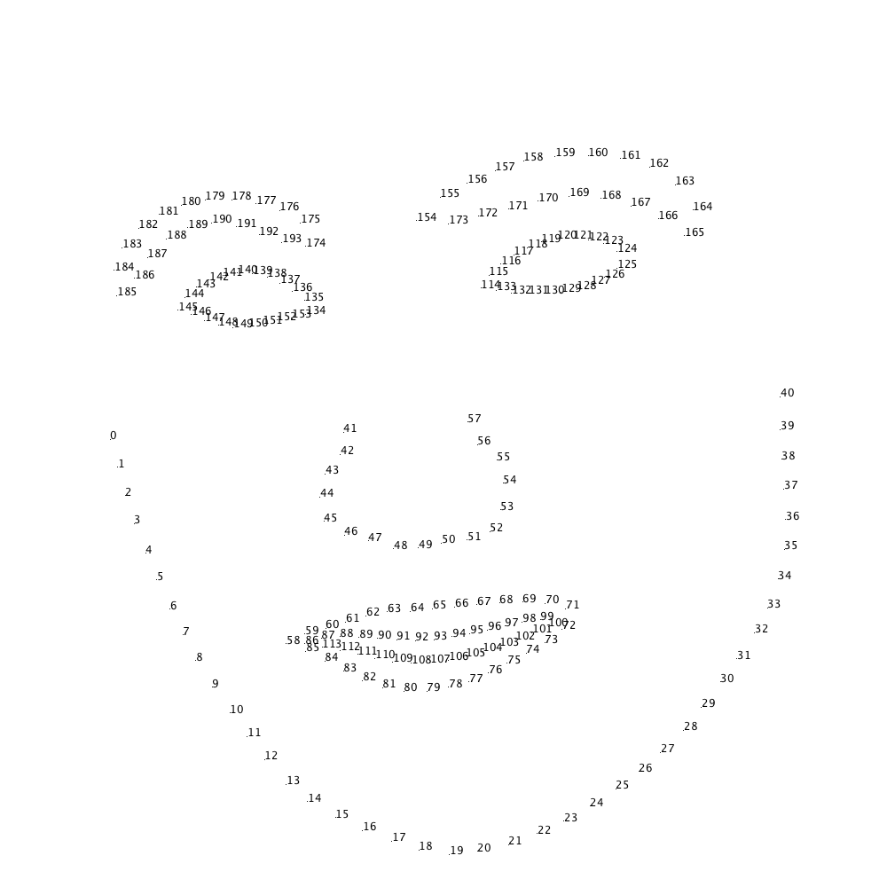

# purikura_lib
ライブラリだよ  

# find.py
探すためのモジュール。  
以下の通り実行すればWEBカメラの画像をリアルタイムで読み込み、顔を認識して各顔パーツに十字をプロットする。

```sh
python3 find.py
```

## find.face_position(gray_img)
顔の位置を認識する。  

    引数: グレーイメージ
    返り値: 顔の位置のリスト [x, y, width, height]


## find.facemark(gray_img)
画像の中から、顔のパーツを認識する。  
複数の顔の中を認識可能。

    引数: グレーイメージ
    戻り値: パーツのポジションのリスト
    [[[x0, y0], [x1, y1]...[x193, y193]](1人目),
     [[x0, y0], [x1, y1]...[x193, y193]](2人目)...]


|n個目の座標|対応部位|
|---:|:---:|
|0~40|顔の輪郭|
|41~57|鼻|
|58~85|口の外側|
|86~113|口の内側|
|114~133|右目| 
|134~153|左目|
|154~173|右の眉毛|
|174~193|左の眉毛|

